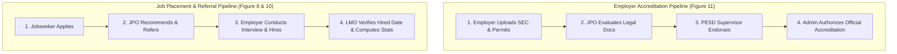

# 🌴 TrabaGo — Cebu City DMDP Employment & Skills Facilitation Platform

> **Official Capstone Project & Platform for the City Government of Cebu — Department of Manpower Development and Placement (DMDP) & Public Employment Service Division (PESD)**

---

## 📌 Project Overview

**TrabaGo** is a multi-role web platform designed to streamline and modernize public employment services, vocational training certifications, corporate employer accreditations, labor market supervision, and placement reporting for Cebu City.

### Key Roles & Ecosystem:
1. **Jobseekers:** Discover jobs, view AI skill-match compatibility, track application stages, manage secure credentials vault, and enroll in DMDP training programs.
2. **Corporate Employers:** Submit legal accreditation papers, post job vacancies, manage applicant pipelines, review JPO referrals, and submit monthly placement reports.
3. **Job Placement Officers (JPO):** Evaluate applicant credentials, recommend jobseeker referrals, evaluate employer accreditation papers, and audit monthly placement reports.
4. **PESD Supervisors:** Review and endorse JPO-evaluated employer accreditations, audit labor placement programs, and monitor compliance metrics.
5. **Labor Market Officers (LMO):** Supervise jobseeker employment statuses, record verified hiring dates, generate monthly placement analytics, and track hiring rates.
6. **Skills Trainers:** Manage DMDP vocational and digital training courses, conduct attendance, and grade participants.
7. **System Administrators:** 3-Pillar authorization center (Job postings, Employer accreditations, Placement reports), user account management, and city-wide audit logs.

---

## 🛠️ System Requirements

Before setting up the project, make sure you have the following installed on your machine:

- **PHP**: `^8.2` or higher (Recommended: PHP 8.2, 8.3, or 8.4)
  - Required PHP Extensions: `pdo`, `mbstring`, `openssl`, `fileinfo`, `curl`, `json`, `tokenizer`, `xml`, `ctype`, `bcmath`
  - For SQL Server users: `php_sqlsrv` and `php_pdo_sqlsrv` extensions + Microsoft ODBC Driver 17/18
- **Composer**: `v2.x` ([Download Composer](https://getcomposer.org/))
- **Node.js & NPM**: Node.js `^18.x` or higher ([Download Node.js](https://nodejs.org/))
- **Database**: Microsoft SQL Server / MySQL / MariaDB / SQLite
- **Git**: ([Download Git](https://git-scm.com/))

---

## 🚀 Quick Start Installation Guide

Follow these steps in your terminal (Command Prompt, PowerShell, or Bash):

### Step 1: Clone the Repository
```bash
git clone https://github.com/lenoj1111/TrabaGo.git
cd TrabaGo
```

### Step 2: Install PHP & Composer Dependencies
```bash
composer install
```

### Step 3: Install NPM Packages & Front-End Assets
```bash
npm install
```

### Step 4: Setup the Environment File
Create a `.env` file by copying the example template:

**On Windows (PowerShell):**
```powershell
Copy-Item .env.example .env
```
**On Mac / Linux / Git Bash:**
```bash
cp .env.example .env
```

### Step 5: Generate Application Encryption Key
```bash
php artisan key:generate
```

### Step 6: Configure Your Database Connection
Open your `.env` file in VS Code or any text editor and configure your database credentials.

#### Option A: Using Microsoft SQL Server (Default Configuration)
```env
DB_CONNECTION=sqlsrv
DB_HOST=localhost
DB_PORT=1433
DB_DATABASE=Trabago1
DB_USERNAME=your_sql_username
DB_PASSWORD=your_sql_password
```

#### Option B: Using MySQL / MariaDB (XAMPP / Laragon / MySQL Workbench)
```env
DB_CONNECTION=mysql
DB_HOST=127.0.0.1
DB_PORT=3306
DB_DATABASE=trabago
DB_USERNAME=root
DB_PASSWORD=
```

#### Option C: Using SQLite (Zero Configuration / Standalone)
```env
DB_CONNECTION=sqlite
```
*(If using SQLite, create an empty file: `database/database.sqlite`)*

---

### Step 7: Run Database Migrations & Seed Demo Accounts
Run the migrations along with the complete database seeder to populate all roles, test users, demo jobs, and accreditation records:

```bash
php artisan migrate --seed
```

> 💡 **Tip:** If you ever need to reset and re-seed the entire database from scratch:
> ```bash
> php artisan migrate:fresh --seed
> ```

---

### Step 8: Link Public Storage for Uploaded Documents
Link the storage directory so uploaded resumes, certificates, and legal accreditation documents are accessible in the browser:

```bash
php artisan storage:link
```

---

### Step 9: Start the Development Servers

Open two terminal tabs:

**Terminal 1 (Laravel Backend Server):**
```bash
php artisan serve
```
*(Server will start at `http://127.0.0.1:8000`)*

**Terminal 2 (Vite Asset Server):**
```bash
npm run dev
```

Now open your browser and navigate to: **[http://127.0.0.1:8000](http://127.0.0.1:8000)** 🎉

---

## 🔑 Pre-Seeded Demo User Accounts

All demo accounts come pre-configured with the default password: **`password123`**

| Role | Email Address | Default Password | Description & Portal Access |
| :--- | :--- | :--- | :--- |
| 👑 **Administrator** | `admin@trabago.com` | `password123` | Approvals Center, System Audit, User Management (`/admin/approvals`) |
| 🏛️ **PESD Supervisor** | `supervisor@trabago.com` | `password123` | Endorse accreditation papers & audit placement queue (`/supervisor/dashboard`) |
| 📋 **Job Placement Officer (JPO)** | `jpo@trabago.com` | `password123` | Evaluate jobseekers, recommend applicants, evaluate employer accreditations (`/jpo/dashboard`) |
| 📊 **Labor Market Officer (LMO)** | `lmo@trabago.com` | `password123` | Supervise jobseekers, track verified hires & placement metrics (`/lmo/dashboard`) |
| 🏢 **Employer 1 (TechCorp)** | `employer@techcorp.com` | `password123` | Accredited employer with active job postings & referrals (`/employer/homepage`) |
| 🏢 **Employer 2 (Cebu BPO)** | `hr@cebubpo.com` | `password123` | Corporate partner portal (`/employer/homepage`) |
| 🧑‍💼 **Jobseeker** | `jobseeker@trabago.com` | `password123` | Job matching, document vault, training programs (`/jobseeker/dashboard`) |
| 🎓 **DMDP Trainer** | `trainer@trabago.com` | `password123` | Skills training programs & class enrollment (`/trainer/dashboard`) |

---

## 🔄 Core System Workflows



### 1. 4-Stage Employer Accreditation (Figure 11)
1. **Employer** uploads business permit, SEC/DTI registration, and BIR 2303 via `/employer/accreditation`.
2. **JPO** reviews and inspects documents via `/jpo/evaluations/accreditations` and clicks **"Recommend & Send to Supervisor"**.
3. **PESD Supervisor** inspects papers via `/supervisor/accreditations` and clicks **"Approve & Send to Admin"**.
4. **Admin** approves via `/admin/approvals` under the Accreditations tab, granting official DMDP accreditation.

### 2. Job Matching, Referral & LMO Supervision
1. **Jobseeker** applies for a position at `/jobseeker/jobs`.
2. **JPO** assesses the applicant at `/jpo/evaluations/jobseekers` and clicks **"Recommend to Employer"**.
3. **Employer** reviews referred candidates at `/employer/referred-jobseekers`, schedules interviews, and marks them as **"Hired"**.
4. **LMO** verifies the placement at `/lmo/jobseekers/supervise`, records the official start date, and monitors monthly placement analytics at `/lmo/reports/monthly`.

### 3. Notification Center
- Built-in notification bell icons with live unread counters are available in the top navbar across all roles (`/employer/notifications`, `/jpo/notifications`, `/supervisor/notifications`, `/lmo/notifications`, `/jobseeker/notifications`).

---

## 🧰 Useful Artisan & Maintenance Commands

```bash
# Clear all cached configurations, routes, and views
php artisan optimize:clear

# Re-run all migrations and fresh seed
php artisan migrate:fresh --seed

# Re-generate application key
php artisan key:generate

# Re-link public storage
php artisan storage:link

# Run automated feature & unit test suite
php artisan test
```

---

## ❓ Frequently Asked Questions & Troubleshooting

### Q: Why do images or uploaded documents show 404?
**Answer:** Ensure you have created the storage symlink by running:
```bash
php artisan storage:link
```

### Q: SQL Server ODBC Driver errors on Windows?
**Answer:** Ensure the Microsoft ODBC Driver 17 or 18 for SQL Server is installed, and your `php.ini` has enabled:
```ini
extension=php_sqlsrv.dll
extension=php_pdo_sqlsrv.dll
```

### Q: Changes in Blade views or routes are not reflecting?
**Answer:** Clear your application caches:
```bash
php artisan optimize:clear
```

---

## 👥 Contributors & Capstone Team

- **Platform:** TrabaGo
- **Department:** Cebu City Department of Manpower Development and Placement (DMDP) / PESD
- **Framework:** Laravel 12 / PHP 8.x / TailwindCSS / Alpine.js / Vite
- **License:** Open-source under the [MIT License](LICENSE)
